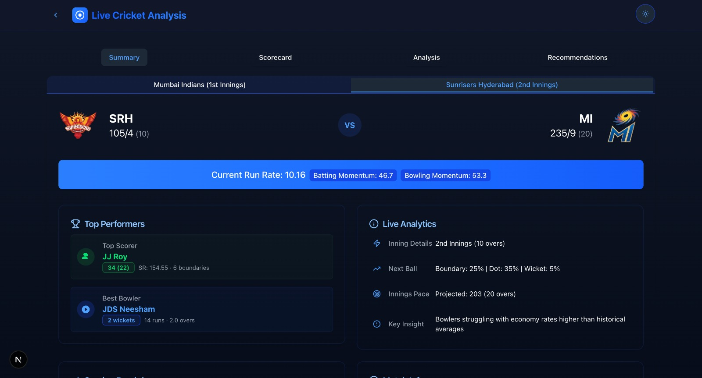
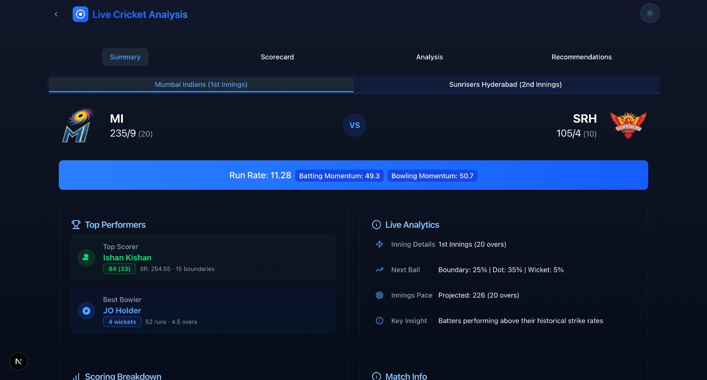

# Crickify - Cricket Match Analysis and Prediction Platform

Crickify is a comprehensive cricket analytics platform that combines machine learning models for match momentum prediction with a modern web interface for real-time cricket match analysis.


*Main dashboard showing live match between Mumbai Indians and Sunrisers Hyderabad*

## Project Screenshots

### Live Match Analysis

*Real-time match analysis with momentum prediction, run rate, and performance metrics*

### Key Features Visible in Screenshots:
- Live score tracking with detailed innings information
- Team-wise momentum analysis (Batting: 49.3, Bowling: 50.7)
- Current run rate and performance metrics
- Top performers highlight (batsmen and bowlers)
- Next ball prediction probabilities
- Detailed match insights and analytics

## Project Structure

The project is organized into three main components:

### 1. Main Model (`/main-model`)
Core machine learning model for cricket analysis:
- Ball-by-ball match data processing
- LSTM-based momentum prediction
- Feature engineering and model training
- Historical statistics computation

### 2. Demo Model (`/demo-model`)
A lightweight version of the main model for testing and demonstration:
- Simplified momentum prediction
- Live match report generation
- CSV to JSON data conversion
- API endpoints for frontend integration

### 3. Frontend (`/frontend`)
Modern web interface built with Next.js:
- Real-time match statistics display
- Interactive scorecards
- Momentum visualization
- Player performance analytics

## Features

- **Match Momentum Prediction**: Uses LSTM neural networks to predict match momentum based on ball-by-ball data
- **Live Match Analysis**: Real-time analysis of ongoing matches with detailed statistics
- **Historical Data Analysis**: Comprehensive analysis of historical IPL matches (2008-2023)
- **Interactive Visualizations**: Dynamic charts and graphs for match progress and player performance
- **Responsive UI**: Modern, responsive interface with dark mode support
- **Real-time Updates**: Live score updates and momentum shifts
- **Player Statistics**: Detailed batting and bowling statistics with performance metrics

## System Architecture


*High-level system architecture diagram showing data flow and component interaction*

## Technology Stack

- **Backend**:
  - Python 3.x
  - TensorFlow/Keras for ML models
  - Flask for API
  - Pandas for data processing
  - NumPy for numerical computations

- **Frontend**:
  - Next.js 13+
  - TypeScript
  - Tailwind CSS
  - Framer Motion for animations
  - Recharts for data visualization
  - Radix UI components


*Technology stack overview*

## Setup Instructions

### Backend Setup

1. Install Python dependencies:
```bash
cd main-model
pip install -r requirements.txt
```

2. Start the Flask server:
```bash
python app.py
```

### Frontend Setup

1. Install Node.js dependencies:
```bash
cd frontend
npm install
```

2. Run the development server:
```bash
npm run dev
```

3. Open [http://localhost:3000](http://localhost:3000) in your browser

## Model Training

To train the momentum prediction model:

1. Prepare your cricket match data in CSV format
2. Run the training script:
```bash
cd main-model
python model.py
```

## API Endpoints

The backend provides several API endpoints:

- `/report`: Get live match analysis and momentum predictions
- Additional endpoints for historical data and player statistics

## Contributing

1. Fork the repository
2. Create a new branch: `git checkout -b feature-name`
3. Make your changes and commit: `git commit -m 'Add new feature'`
4. Push to the branch: `git push origin feature-name`
5. Submit a pull request

## License

[Add your chosen license here]

## Acknowledgments

- IPL dataset providers
- Cricket statistics resources
- Open-source libraries and frameworks used in the project